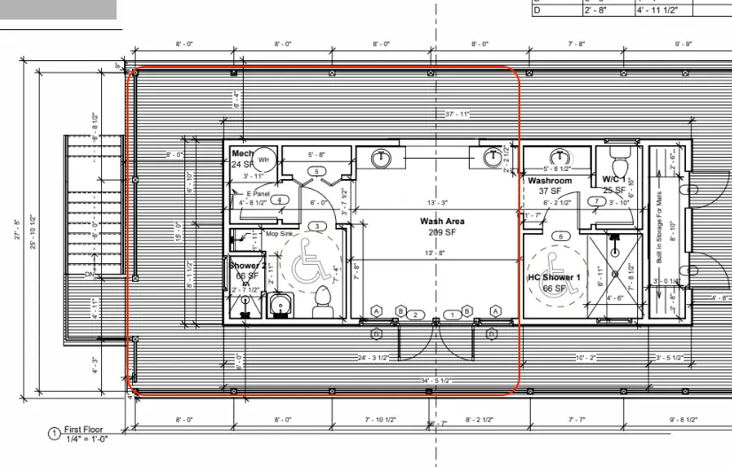
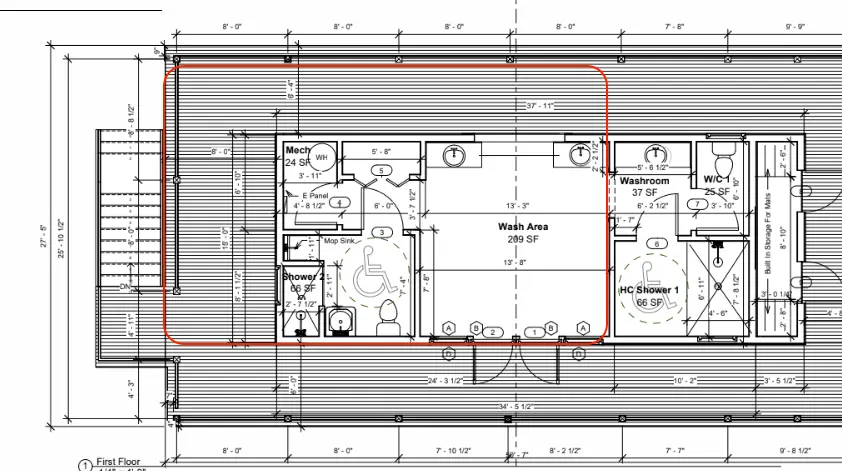

# Full Compliance Checklist

Based on the provided documents regarding the Southern Dharma Retreat Center bathhouse, the primary building code and structural compliance issues identified are as follows:

### Structural Compliance

- **Roof and Ridge Reinforcement:** The roof structure requires reinforcing with a second layer of 2x6 beams, and a third layer of 2x12s must be installed on the ridge to meet state structural compliance.
- **Floor Reinforcement:** The floor structure requires reinforcement with 2x10 beams and 2x6 joists per the engineering plans.
- **Structural Engineer Approval:** Structural corrections must strictly adhere to the sealed drawings provided by the structural engineer, Cole Roberts of Medlock Engineering.

### Architectural & Accessibility Compliance

- **Porch and Deck Railings:**
  - The entire porch needs wood pickets/balusters to meet North Carolina building code requirements.
  - Handrails and balusters must have openings of no less than 4 inches to maintain safety clearances.
- **Stair Risers and Treads:**
  - Stair risers can be a maximum height of 8 1/4 inches.
  - Treads must have a minimum depth of 10 inches.
  - Riser heights must be uniform, with a maximum variation tolerance of 3/8 inch between them.

### Electrical & Utilities Compliance

- **Exposed Wiring Protection:**
  - Exposed exterior wiring (such as the hallway ceiling and porch areas) must be enclosed in galvanized conduit.
  - Exterior junction boxes must be installed per building code at the three automatic flood lights that have exposed wires.
  - Conduit must be run to all exterior automatic flood lights as required by electrical codes.
- **Electrical Panel Labeling:** All switches on the electrical circuit panel must be properly and clearly labeled.

### Plumbing, Insulation, & Environmental Compliance

- **Drain Heights & Grading:** Floor drain heights in the shower areas must be properly leveled. The circular drain in the right-side shower was installed above the floor level, which prevents water from draining properly, causing pooling on the tiles and subsequent water damage to the subfloor.
- **Floor Insulation:** Under-floor insulation must be installed to meet state energy code requirements.
- **Pipe Freeze Protection:** Water pipes running underneath the floor must be insulated, and vertical runs must be protected down to the ground level to prevent freezing.

Would you like me to draft a formal email to Master Service Construction summarizing these requirements along with the deadline constraints?

# Movement Space + Bathroom Hybrid proposals

A note on per person space consideration:
The second arrangement says the space would be very tight for 24 practitioners. However, I have participated in multiple packed classes at Asheville Yoga center with mats between 3" apart to the side and 6" between rows with my extra-long mat for a vinyasa class with very dynamic movement. The AI Response considers 6'x4' per student a tight fit which allots a foot on either side of a standard mat for a person's rectangle, which is 2' between practitioners. This is ample space for anyone who regularly attends popular yoga classes.

What is the average number of people on retreat at Southern Dharma at present?

Here's the two scenarios I mapped out with a hybrid bathroom + movement space.

## 27 x 32

### Proposed modifications

- Movement space in red
- Door to movement space at the top of the stairs and on either side of the deck outside the bathrooms.
- HC Shower becomes external entrance door for bathroom _or_ existing shower is moved to HC Shower location and storage closet is reduced by half to allow for the left door to go through to the bathroom if code allows for the removal of the HC accessible bathroom.

### Diagram

Results from AI Mode for the space calculation:

Yes, a $27 \times 32$ foot $(864 \text{ sq ft})$ space will comfortably fit 24 yoga practitioners. This allows for an average of $36 \text{ sq ft}$ per student, leaving ample room for standard mats, safe movement, and an instructor zone.

Space Breakdown

- **Total Room Area:** $864 \text{ sq ft}$
- **Average Standard Mat:** $12 \text{ sq ft}$ ($72^{\prime \prime} \times 24^{\prime \prime}$)
- **Recommended Buffer Space:** $20$ to $25 \text{ sq ft}$ per person for arm extensions and transitions

Layout Considerations

With $36 \text{ sq ft}$ per person, you can easily arrange a grid of $4 \times 6$ mats while dedicating over $150 \text{ sq ft}$ at the front or center for the instructor.

## 21 x 32

### Proposed modifications

- Movement space in red
- Door to movement space at the top of the stairs and on north side of the deck outside the bathrooms.
- HC Shower becomes external entrance door for bathroom _or_ existing shower is moved to HC Shower location and storage closet is reduced by half to allow for the left door to go through to the bathroom

### Diagram

Yes, a 21 × 32 foot (672 sq ft) space can fit 24 yoga practitioners, but it will be **very tight** and right at maximum capacity.

This layout allocates exactly 28 sq ft per person, which requires a highly organized grid and leaves minimal breathing room.

Space Breakdown

- **Total Room Area:** 672 sq ft
- **Space Per Person:** 28 sq ft (including the instructor)
- **Standard Mat Size:** 12 sq ft (2' × 6')
- **Buffer Space:** Only 16 sq ft per person for movement and gear

Optimal Mat Arrangement

To make 24 people fit, you must arrange the room in a strict **4 × 6 grid** (4 mats along the 21-foot wall, 6 mats along the 32-foot wall).

- **The 21-foot width:** 4 mats (4 × 2' = 8' used) leaves 13 feet of total aisle space, or about **3.2 feet of space between rows**.
- **The 32-foot length:** 6 mats (6 × 6' = 36' used). _Note: This exceeds 32 feet if placed end-to-end, meaning mats must be turned sideways (landscape orientation) or packed with zero gap._

[Publish Link](https://yogat3ch.github.io/writing/notes/bathhouse.html)
